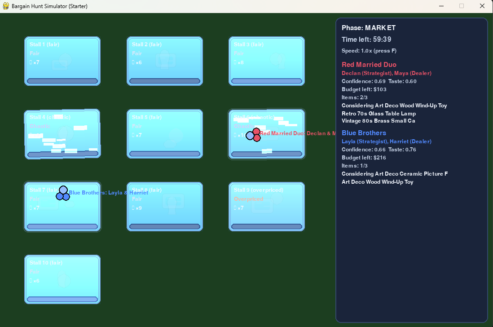
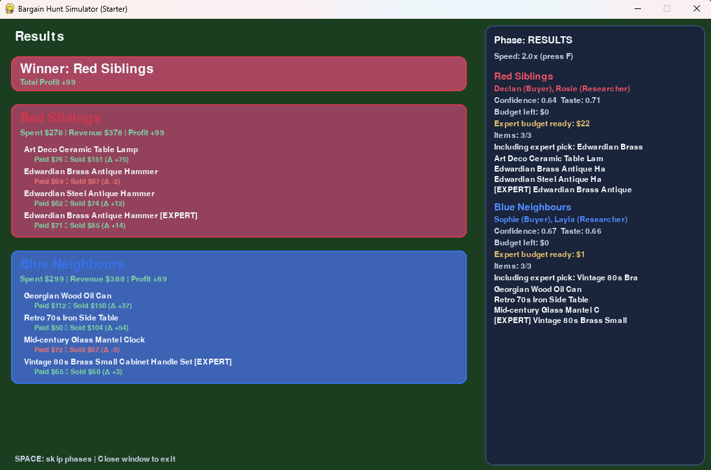
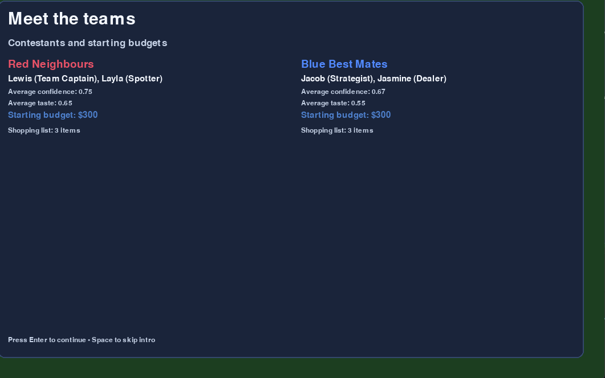
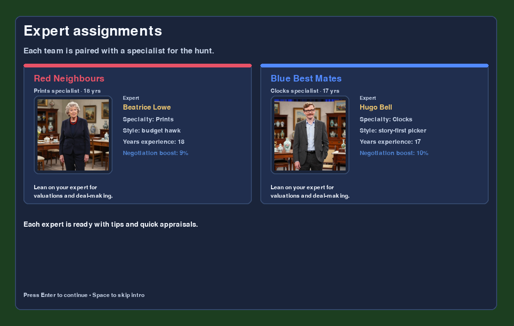
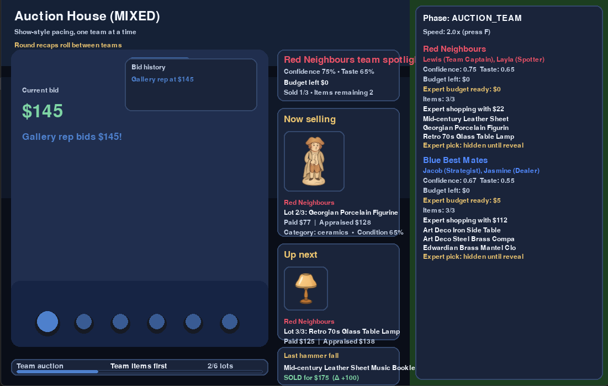
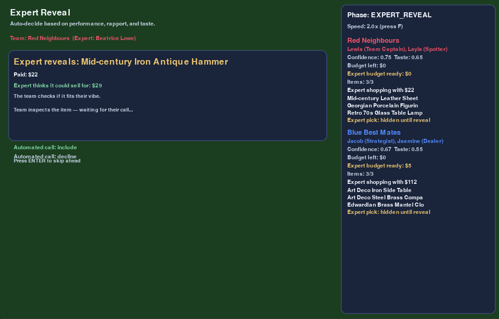

# Bargain Hunt Simulator

An AI-driven mini-simulation of a *Bargain Hunt*-style episode. Two teams roam a procedurally generated market, buy antiques with expert guidance, take one last expert pick from the leftovers, then head to appraisal, auction, and scoring—with narrated intros, richer item data, and animated auctions along the way.

## Screenshots








## Features
- **Cinematic intro sequence:** Optional splash video plus host, contestant, expert, and market send-off cards set the stage; skip anytime with Space or fast-forward with Enter/Right.【F:config.py†L7-L22】【F:game_state.py†L10-L48】【F:ui/screens/intro_screens.py†L15-L101】
- **Procedural fairground:** Each episode builds ten stalls with varied pricing styles, discount behavior, and randomized stock while adapting layout to the available play space.【F:models/market.py†L12-L57】
- **Richer item datasets:** Swap between bundled assets, a generated JSONL set with images, or a combination via `--item-source`, enabling auctions to render real item photos when present.【F:main.py†L12-L36】【F:sim/item_factory.py†L28-L63】【F:sim/item_database.py†L74-L123】【F:ui/screens/auction_screen.py†L1-L150】
- **Personality-driven teams:** The Red (ValueHunter strategy) and Blue (RiskAverse strategy) duos rely on contestant confidence/taste plus their dedicated experts for valuations, negotiation boosts, and movement targets.【F:models/episode.py†L29-L86】【F:ai/strategy_value.py†L6-L27】【F:ai/strategy_risk.py†L6-L27】
- **Negotiation and leftover advice:** Purchases include chance-based haggling bonuses and an automatic expert leftover proposal once shopping ends; teams auto-accept or decline based on strategy and remaining budget.【F:models/episode.py†L88-L157】【F:models/episode.py†L183-L216】【F:sim/pricing.py†L3-L18】
- **Appraisal and auction drama:** An independent auctioneer appraises all items before a paced auction sequence that simulates bids, bidder identities, hammer calls, and progress tracking, with images pulled from assets when available.【F:models/episode.py†L218-L251】【F:models/auction_house.py†L4-L33】【F:ui/screens/auction_screen.py†L150-L268】
- **Scoreboard with Golden Gavel:** Totals track spend/revenue/profit and award the Golden Gavel when all three team-bought items profit, then declare the winner by profit.【F:sim/scoring.py†L1-L12】【F:models/episode.py†L253-L260】【F:ui/screens/results_screen.py†L1-L87】

## Run
1. (Optional) Create a virtual environment.
2. Install dependencies:
   - `pip install -r requirements.txt`
3. Launch the simulator:
   - `python main.py`

At startup the app plays an 8-second intro video from `assets/video/into_vid.mp4`; set `show_splash_video = False` in `config.py` to skip it.

Command-line options let you set the random seed, pick an episode index, choose the item dataset, and adjust the market timer:

```bash
python main.py --seed 42 --episode 2 --market-minutes 30
# or set seconds directly
python main.py --market-seconds 600
# load bundled assets, generated items with images, or both
python main.py --item-source combined
```
【F:main.py†L1-L36】【F:config.py†L7-L22】【F:sim/item_factory.py†L28-L63】

## Controls
- **SPACE**: Skip to the next phase (market → expert pick → appraisal → auction → results).【F:game_state.py†L27-L48】
- **F**: Cycle simulation speed multipliers (2×, 10×, 20×) during any phase.【F:game_state.py†L62-L77】
- All shopping, expert decisions, appraisals, and auctions run automatically—just sit back and watch the episode unfold.

## Bargain Hunt Simulator: Feature Analysis and Simulation Dynamics

### Abstract
Bargain Hunt Simulator orchestrates an end-to-end episode of a televised antiques competition, combining procedural content generation, lightweight AI strategies, and probabilistic market dynamics. This paper surveys the system’s architecture, details key parameters that govern realism and pacing, and analyzes the simulation pipeline from market setup through auction outcomes.

### 1. Introduction
The project recreates the show flow—intro, market shopping, expert handoff, appraisal, auction, and results—within a Pygame-driven UI. It emphasizes deterministic reproducibility via seeds, modular balance configuration, and interchangeable item datasets that carry both metadata and imagery for richer presentation.

### 2. System Overview
- **Runtime entrypoint:** `main.py` parses CLI controls (seed, episode, market duration, item source) and launches the UI app.
- **Configuration layer:** `config.py` defines window, pacing, expert behavior, and market timing defaults; parameters are passed into `GameState`.
- **State machine:** `game_state.py` advances phases, manages time scaling, and delegates rendering to screen classes under `ui/screens`.
- **Simulation kernel:** `models/episode.py` coordinates market generation, team AI, host movement, expert shopping, appraisal, auction sequencing, and scoring.
- **Data/modeling modules:** Item generation (`sim/item_factory.py`, `sim/item_database.py`), market layout and pricing (`models/market.py`, `sim/pricing.py`), auction mechanics (`models/auction_house.py`, `models/auctioneer.py`), and strategic AI behaviors (`ai/strategy_value.py`, `ai/strategy_risk.py`).

### 3. Feature Deep-Dive
#### 3.1 Procedural Market and Inventory
Ten stalls are laid out in a grid sized to the play area, each tagged with pricing styles—fair, overpriced, or chaotic—impacting shop-price multipliers. Inventory is populated by either curated JSON templates, generated JSONL records, or synthetic fallback items, ensuring every run has sufficient variety. True item value is drawn from a lognormal distribution with condition, rarity, and style factors to allow occasional high-value “finds.”

#### 3.2 Team Personalities and Strategies
Two teams spawn with distinct strategies:
- **ValueHunter:** Prioritizes stalls with many affordable options, then seeks high expert-estimated margins adjusted by style affinity and confidence.
- **RiskAverse:** Prefers stalls with higher average condition, filters out low-condition items, and targets safer margins.

Spend plans embedded in strategies enforce budget discipline and pacing across the three required purchases.

#### 3.3 Negotiation and Expert Influence
Purchases can trigger negotiation where success probability combines stall discounts and expert bonuses, bounded by global negotiation ceilings. Experts also modulate consultation duration, trust-weighted chat probability, target margins, and post-market leftover picks funded by reserved budgets, adding personality-driven variance to item selection.

#### 3.4 Temporal and Spatial Dynamics
Movement is governed by pixel-per-second speeds scaled by a market pace multiplier; buy actions require proximity (`buy_radius_px`). Teams wander, consult, reconsider (“backtrack”), or commit to purchases based on timers drawn from configurable ranges, producing naturalistic shopping cadence. Host avatars exit the scene according to separate timing and speed parameters to mirror televised pacing.

#### 3.5 Appraisal and Auction Pipeline
An independent auctioneer appraises items using accuracy-driven lognormal noise, clamped by appraisal caps to prevent runaway valuations. The auction house applies category demand multipliers, condition adjustments, and episode mood (hot/cold/mixed) to compute sale prices with bounded volatility. Auctions proceed through team items, then optional expert picks, recording realized margins per lot.

#### 3.6 Scoring and Rewards
Totals compute spend, revenue, and profit per team; the Golden Gavel bonus is awarded when all three team-bought items profit, echoing show incentives. The winner is chosen by profit, while HUD elements summarize budgets, appraisals, and auction outcomes.

### 4. Parameterization and Scientific Underpinnings
- **Stochastic foundations:** A single RNG drives layout, inventory draws, movement jitter, negotiation results, and auctions, making seeds reproducible experiments.
- **Balance configuration:** `sim/balance_config.py` centralizes tunables (pricing ranges, negotiation bounds, auctioneer accuracy, auction mood distributions, appraisal caps, and gavel thresholds). This separation allows controlled experiments on market liquidity, volatility, and appraisal bias.
- **Human-like behavior modeling:** Timers for decision and consultation durations, revisit probabilities, and cooldowns encode bounded rationality and attention switching, while team formation offsets maintain coherent on-screen motion.
- **Economic realism:** Pricing styles set pre-auction anchor values; negotiation clamps prevent exploitative discounts; auction demand and mood emulate market sentiment; appraisal clamping avoids overvaluation bubbles.

### 5. Relevance and Use Cases
- **Design exploration:** Adjusting balance configs or item sources tests how pricing regimes, expert skill, or auction sentiment affect profitability distributions.
- **AI behavior studies:** Comparing ValueHunter vs. RiskAverse outcomes across seeds highlights sensitivity to condition thresholds and margin targets.
- **Content authoring:** Template-driven items with imagery allow rapid expansion of episodes without code changes, enabling qualitative user studies on perceived realism.
- **Educational demos:** The simulator illustrates end-to-end economic pipelines—sourcing, negotiation, appraisal, and auction—within an interactive, observable environment.

### 6. Future Investigation Directions
- Sensitivity analysis on negotiation probabilities and appraisal caps to quantify profit variance.
- Comparative runs with different item datasets to measure how visual fidelity influences perceived fairness or enjoyment.
- Parameter sweeps on market duration and pace to balance watchability against strategic depth.
